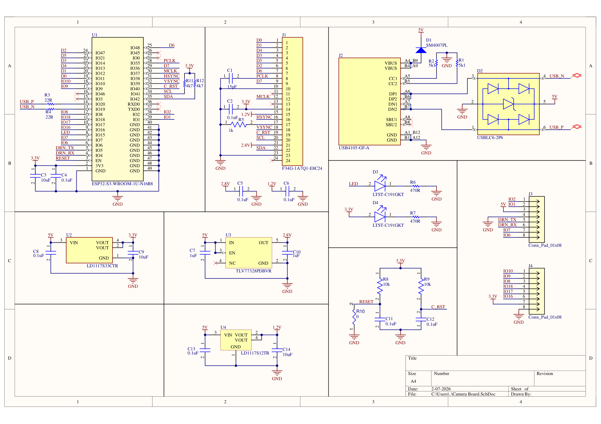

# Barebones ESP32-CAM

## Overview

When building a drone, space and weight are critical considerations. Most commercial ESP32-CAM modules feature a double-stacked design that complicates packaging and includes unnecessary features for aerial applications. This custom-designed board addresses these limitations with a compact, flat, single-stack PCB optimized for drone integration.

## Features

- **ESP32-WROOM-1U Module**
  - Native 8-bit camera interface
  - External antenna for extended range
  - Built-in USB flashing (eliminates USB-to-UART converter requirement)
- **40-Pin FPC Connector** for OV2640 camera module
  - Integrated 5V to 2.8V and 5V to 1.8V LDO regulators for camera power
- **USB-C Port** for programming and debugging
- **GPIO Expansion** - All GPIO pins exposed via headers
- **Flexible Power Options**
  - USB-powered or external 5V supply
  - Reverse current protection via Schottky diode

## Assembly

This board can be manufactured through JLCPCB with their PCB Assembly (PCBA) service. The bill of materials is provided below, and the complete PCBA BOM is available at [Output/JLC_BOM.xlsx](Output/JLC_BOM.xlsx).

**Note:** The ESP32-WROOM-1U module must be purchased and soldered separately, as it cannot be included in the standard JLCPCB PCBA service.

### Bill of Materials

| Item           | Cost       | Quantity | Link                                                  |
| -------------- | ---------- | -------- | ----------------------------------------------------- |
| PCB from JLC   | $45.51     | 1        | [Images/Cart.png](Images/Cart.png)                    |
| ESP32-WROOM-1U | $5.33      | 1        | https://www.lcsc.com/product-detail/C3013946.html     |
| OV2640 Camera  | $6.65      | 1        | https://www.aliexpress.com/item/1005003040149873.html |
| **Total**      | **$57.49** |          |                                                       |

## Board Images

### Schematic

### Top Layer (Signal / GND)

### Bottom Layer (Signal / GND)

## License

This ESP32-CAM hardware is licensed under CERN-OHL-S v2. See the full license text in [../LICENSE-HARDWARE](../LICENSE-HARDWARE).
